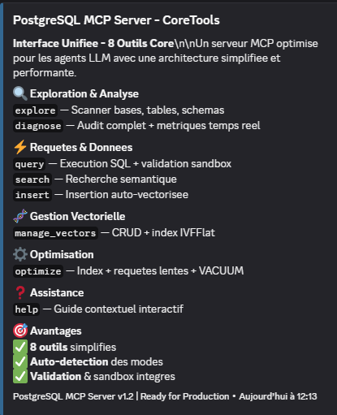

<p align="center">
  
</p>

<br>

<p align="center">
  <a href="https://www.typescriptlang.org/"></a>
  <a href="https://nodejs.org/"></a>
  <a href="https://www.postgresql.org/"></a>
  <a href="https://zod.dev/"></a>
  <a href="#"></a>
</p>

---



Un serveur MCP pour interagir avec PostgreSQL via Claude.

## 🚀 Démarrage Rapide

### Prérequis

- [Node.js](https://nodejs.org/) (v18 ou plus)
- [pnpm](https://pnpm.io/) (v8 ou plus)
- Une base de données PostgreSQL accessible

### Installation

```bash
# Cloner le projet
git clone https://github.com/DeamonDev888/PostgreSQL-MCP-Serveur.git
cd PostgreSQL-MCP-Serveur

# Installer les dépendances
pnpm install

# Configurer la base de données
cp .env.example .env
# Éditer .env avec vos paramètres PostgreSQL

# Compiler le projet TypeScript
pnpm build

```

## ⚙️ Configuration

### .mcp.json

```json
{
  "mcpServers": {
    "postgresql": {
      "command": "node",
      "args": ["C:\\Path\\To\\PostgreSQL\\dist\\index.js"]
    }
  }
}
```

## 🛠️ Stack

TypeScript • FastMCP • node-postgres • Zod • pnpm

## 📄 Licence

MIT

---

## 🔌 Installation de pg_vector (optionnel)

Pour utiliser la recherche vectorielle, installez l'extension : https://github.com/pgvector/pgvector

- **Windows** : https://github.com/pgvector/pgvector/blob/master/README.md#windows
- **Linux** : `sudo apt install postgresql-16-pgvector`
