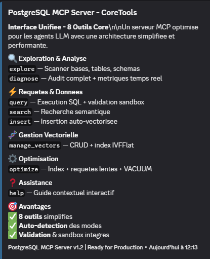

<p align="center">
  
</p>

<br>

<p align="center">
  <a href="https://www.typescriptlang.org/"></a>
  <a href="https://nodejs.org/"></a>
  <a href="https://www.postgresql.org/"></a>
  <a href="https://zod.dev/"></a>
  <a href="#"></a>
</p>

---



Un serveur MCP pour interagir avec PostgreSQL.

## 🚀 Démarrage Rapide

### Prérequis

- [Node.js](https://nodejs.org/) (v18 ou plus)
- [pnpm](https://pnpm.io/) (v8 ou plus)
- Une base de données PostgreSQL accessible

### Installation

```bash
# Cloner le projet
git clone https://github.com/DeamonDev888/PostgreSQL-MCP-Serveur.git
cd PostgreSQL-MCP-Serveur

# Installer les dépendances
pnpm install

# Configurer la base de données
cp .env.example .env
# Éditer .env avec vos paramètres PostgreSQL

# Compiler le projet TypeScript
pnpm build

```

## ⚙️ Configuration

### .mcp.json

```json
{
  "mcpServers": {
    "postgresql": {
      "command": "node",
      "args": ["C:\\Path\\To\\PostgreSQL-MCP-Serveur\\dist\\index.js"]
    }
  }
}
```

## 🛠️ Stack

TypeScript • FastMCP • node-postgres • Zod • pnpm

## 📄 Licence

MIT

---

## 🔌 Installation de pg_vector

Pour utiliser la recherche vectorielle, installez l'extension pgvector
avec docker sur Windows

**Windows**

```bash
# Utiliser l'image officielle avec pgvector préinstallé
docker pull pgvector/pgvector:pg16
```

**Linux/Mac**

```bash
sudo apt install postgresql-16-pgvector
```

---

## 🧠 Intelligence Sémantique (New v1.1)

Le serveur supporte désormais nativement **Qwen3 Embedding 8B** via OpenRouter pour des recherches sémantiques haute précision.

- **Modèle** : `qwen/qwen3-embedding-8b` (4096 dimensions).
- **Mode Strict** : Pas de données simulées. Si l'API est absente, le service s'arrête.
- **Configuration** :
  Ajoutez votre clé API dans `.env` :
  ```env
  OPEN_ROUTER_API_KEY=sk-or-v1-...
  ```
- **Maintenance** :
  Script de backfill inclus pour mettre à jour l'historique :
  `npx tsx src/scripts/backfill_embeddings.ts`

---

## 💡 Exemples d'Usage (Agent)

### 1. Préparer une table pour Qwen (4096 dimensions)

```typescript
use_tool("manage_vectors", {
  action: "create",
  table: "knowledge_base",
  dimensions: 4096, // Standard Qwen 8B
});
```

### 2. Sauvegarder un document (Auto-Embedding)

```typescript
use_tool("insert", {
  table: "knowledge_base",
  data: {
    category: "documentation",
    title: "Guide d'Installation",
    content: "Pour installer le système, commencez par cloner le dépôt...",
    author: "DevTeam",
  },
  generateEmbedding: true, // 🪄 Génère le vecteur 4096d automatiquement
});
```

### 3. Recherche de contexte (RAG)

```typescript
use_tool("search", {
  query: "Comment installer le système ?",
  table: "knowledge_base",
  mode: "hybrid",
  topK: 5,
});
```

---

## 📦 Outils Disponibles

Liste complète des 9 outils Core simplifiés : [Voir la documentation des outils](docs/liste_outils.md)
